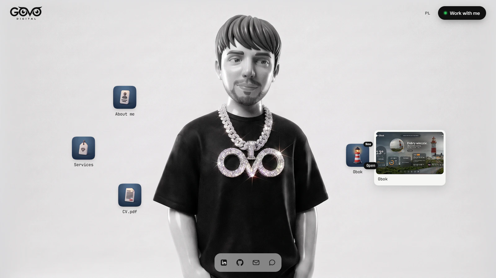

<p align="center">
  <a href="https://www.govodigital.com">
    <picture>
      <source media="(prefers-color-scheme: dark)" srcset=".github/readme/logo-light.svg">
      
    </picture>
  </a>
</p>

<p align="center">
  <strong>Piotr Goworek — frontend developer</strong><br>
  <a href="https://www.govodigital.com">govodigital.com</a> · <a href="https://www.govodigital.com/en">English version</a>
</p>



My portfolio, built as a living desktop. In the middle stands a black-and-white character rendered in WebGL2 that follows your cursor; the files around it open windows with a case study, services, pricing and my CV. Every window has its own URL, and the whole site is available in Polish and English. All graphics and video on the site are generated and edited by me.

## Highlights

- **WebGL2 character, no libraries.** One canvas composites separate layers: the base image, irises clipped by eye masks, highlights, eyelids and sparkles on the pendant, then warps the frame for breathing, a slight head turn and a chain that swings with a delay. The gaze follows the cursor on a spring and looks at the file under it, the open window or the focused form field. An end-to-end test checks a median frame time under 17.5 ms (60 fps) with the CPU throttled 4×. Without WebGL2, on slow devices and with reduced motion it falls back to a still image.
- **Windows and motion.** Files open as windows that grow out of their icon. Each window is server-rendered at its own address and works with the browser's back button. Animations use only transform and opacity; with `prefers-reduced-motion` content renders in its final state, the intro becomes a plain fade and the custom cursor is off.
- **CV generated from the site.** The CV is a regular page; a build script prints it to PDF in Chromium for both languages and fails if it does not fit on one A4 page.
- **SEO.** Canonical URLs, hreflang with x-default, a sitemap of every page in both languages, JSON-LD (Person, CreativeWork, Service with Offer, BreadcrumbList), Open Graph images, and 301 redirects for every address of the previous site.
- **Performance.** Images are pre-encoded to AVIF and WebP with hashed file names and a one-year cache; the character's textures are decoded in a worker.

**Stack:** Next.js 16 (App Router), React 19, TypeScript, Tailwind CSS 4, Motion, Zod, WebGL2, Vitest, Playwright, Vercel.

## Development

Requires Node.js, pnpm and a local Chrome for the end-to-end tests.

```bash
pnpm install
pnpm dev       # http://localhost:3000/pl
pnpm test      # unit tests
pnpm e2e       # end-to-end tests (builds and serves on port 3100)
pnpm images    # re-encode images to AVIF/WebP
pnpm cv        # regenerate the CV PDFs
```

Environment variables (`.env.local`):

- `RESEND_API_KEY` — sends messages from the contact form
- `CONTACT_DRY_RUN` — runs the contact form without sending e-mail (ignored in production)
- `CV_BASE_URL` — server used by `pnpm cv`; without it the script starts its own

## Rights

The source code is public for review only. The graphics, video, the character and the GOVO DIGITAL logo are © Piotr Goworek. All rights reserved: no part of this repository may be copied, modified or reused without my written permission.
